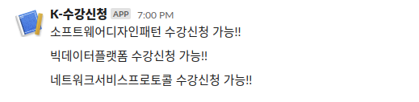

# 국민대학교 수강신청 알리미 K-Hunter

수강신청을 원하는 과목이 열렸는지 Slack 채널로 알려드립니다.

## How to run
- `src/index.js`에서 `LECTURE_CODE`와 `LECTURE_NAME`을 원하는 과목 코드와 이름으로 설정(순서 일치해야함)

### How to run(Github Actions)
- Fork repository
- `Settings` - `Secrets` - `Add a new secret` 메뉴로 진입
- `ID`, `PASSWS`, `WEBHOOKS`를 각각 종합정보시스템 id, password, 슬랙 봇 Incommig Webhooks 주소로 저장

### How to run(local)
- `src/index.js`에서 `ID`, `PASSWD`를 종합정보시스템 id와 password로 설정
- `src/index.js`에서 `WEBHOOKS`를 슬랙 봇 Incommig Webhooks 주소로 설정
- `npm run build`
- `npm start`